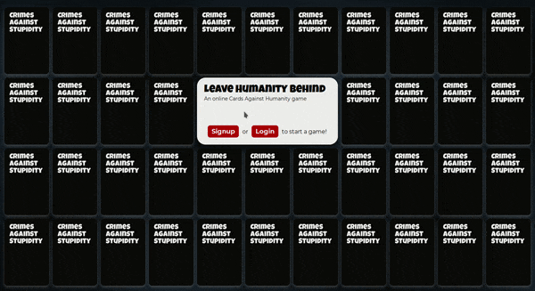
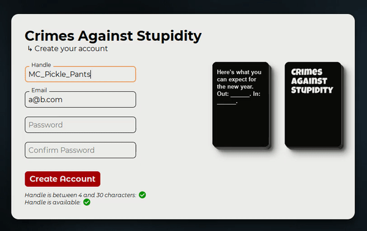
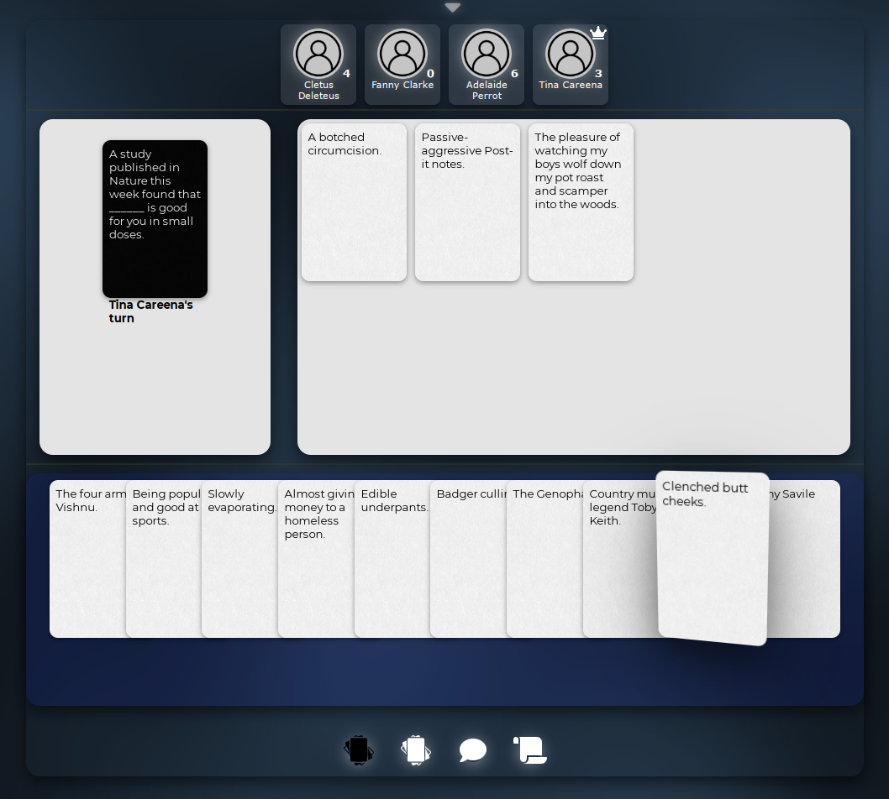
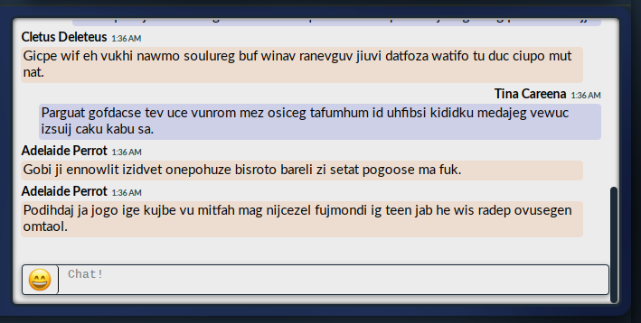

# Crimes Against Stupidity

Live Project: Not Yet Available

Crimes Against Stupidity is an online version of the game 
[Cards Against Humanity](https://en.wikipedia.org/wiki/Cards_Against_Humanity),
'a party game in which players complete fill-in-the-blank statements using words
or phrases typically deemed as offensive, risque, or politically incorrect.'

When complete, users will be able to start a profile and create or join persistent,
real-time games with other players online.  Users will have access to in-game
chats, game history, and even player stats/leaderboards.  Games can be made
private, and a password set for sessions with close friends.  Alternatively,
users can spectate public games without having to directly participate.

This project is a WIP and missing most vital features.  It will be updated
with new features daily for a while.  Check back if you're interested!


### Featured Stack
  **MERN**
  * MongoDB
  * Express
  * React
  * NodeJS/JavaScript 

### Libraries and Frameworks
React, Redux, Axios, Mongoose,
  Chance, Websockets (socket.io)


# Entry Point
  

&nbsp;

The main splash gives you directions to sign in or sign up.  You can see
from the start that even the landing page, while simple, is interactive.
Every card element and notification that appears on the site will have a 
mix of animation and interactivity.  The cards present on the landing are
randomly pulled from the database and will be different each time the page
reloads.


# Signup
<p>
  
  Login/Signup splashes offer real-time input validations and check
  against the database for existing users. More card animations in both as well.
  For efficiency, the cards pulled from the database for the entry point are shared
  between the signup/login to prevent excessive calls to the database.
</p>


&nbsp;

&nbsp;

&nbsp;

# Game Page
### Simplicity.  Interactivity.


This is a WIP of the game page.  When complete it will contain
several features, such as on-screen history, collapsible navigation, settings, 
active game rules, message notifications, etc.  The bottom icons activate different
feature sets, such as displaying the game's history, the cards you've won, or
in-game group messaging. Every card can be inspected and is interactive.

&nbsp;

The game page was designed to be as small as possible.  The ideal goal is to 
create a collapsible enough viewport that players will keep the game up on their 
screen without consuming much real-estate.  Studies have
shown that simple, compact websites stay up and in the user's view longer 
than any alternative design schema.  All content, cards in play, player cards, 
and icon-notifications for an 8-player game will fit on less than a 750x850px viewport.

&nbsp;

&nbsp;
## Messaging and Chat


Chat, like the rest of the game page, is real-time and provided through a MongoDB
database and a websocket API via socket.io. It also features a full emoji bar
mimicking the likes of Slack or FaceBook, as well as dynamic timestamps
('Yesterday at 12:01PM', 'Two days ago', 'Last week', etc.)  

&nbsp;

&nbsp;

&nbsp;


## Code Snippets

Here's a glimpse of the getter for animation frames inside the *Phase* component.  
It's a React implementation of a 'card look' animation seen in some older jQuery animations.
The returns are fed into a snippet like the one below the getter, and then into JSX
styling in the return div.

The component is written as a wrapper and can be tied around several card animations,
including other react transforms, pure CSS, and CSSTransitions.

```js  
  getValues(event) {
    const xPos = event.nativeEvent.clientX - this.left;
    const yPos = event.nativeEvent.clientY - this.top;
    
    const x = xPos / this.width;
    const y = yPos / this.height;
    const _x = Math.min(Math.max(x, 0), 1);
    const _y = Math.min(Math.max(y, 0), 1);
    const tiltX = (this.reverse * (this.settings.max / 2 - _x * this.settings.max)).toFixed(2);
    const tiltY = (this.reverse * (_y * this.settings.max - this.settings.max / 2)).toFixed(2);  
    const percentageX = _x * 100;
    const percentageY = _y * 100;  
    
    return {
      tiltX,
      tiltY,
      percentageX,
      percentageY
    }
  } 

  // Simplified styling example
  const style = {
    transform: `perspective(${persp}px) rotateX(${tiltY}deg) rotateY(${tiltX}deg) scale(${scale})`
  }
```

&nbsp;

One such example that can be wrapped by the *Phase* component is the card flip animation.
It's represented by a stateless functional component and operates on pure CSS.
While not depicted here, some functions such as the the card-stack effect seen
on the signup page utilize CSSTransitions via the `react-transition-group` module to
seamlessly combine a few different effects and classes.
```js
export default function CardFlipHover (props) {

  return (
    <div className={`card_fh-container ${props.className}`}>
      <div className="card_fh-inner-black">
        <div className="card-front-black">
          <Name />
        </div>
        <div className="card_fh-back-black">
          <h5>{props.content}</h5>
        </div>
      </div>
    
    </div>
  )
}
```

### Cards Against Humanity Card Data
Small note, the card data was collected via the freely available online API at
https://cah.greencoaststudios.com/ and ported into MongoDB via a connecting/seeding
API developed for this project.

# Credits - Warnings - Acknowledgments
* I take no credit for the Cards Against Humanity data/contents and am using it
as provided via a freely available API.
* CAH is not without its controversies and some may find the game's phrases 
offensive.  I don't condone any form of hate-speech, violence, racism, sexism,
homophobia, etc.  Some cards have not aged well.  Others have been acknowledged 
as problematic and removed outright. Punch up, not down.
* While more an exercise/demonstration than a fully fledged site, chat/messaging
will include at least some basic system to ban players whose comments demonstrate their
inability to differeniate between politcally incorrect satire and cruel hatespeech.
A letter of all the naughty things they've said will be sent to their mothers.
* This application, its content, and all related materials should represent a safe space for everyone.


### Readme TO DO
  * MongoDB/Mongoose showcase
  * websocket showcase
  * state showcase


## Site Features (Upon completion)
* Protected signup/login
* User profiles
* Site-wide stats, scores, and listings
  1) Most points won
  2) Most games won
  3) Favorite cards, card packs
  4) Most rounds completed... etc.
* In-game messaging
* Friends lists
* Invite alerts
* Private games
* Spectator games/events
* Game Rules
* Card Pack selection / favorites
* Custom cards


## TO DO
* Message and Landing pagination
* Full websockets
* Game cycle
* Profiles
    1) user info
    2) friends list
    3) invites
    4) personal stats
    4) block list
* History
* Won Cards
* In-game host notifications
* Game creation page
* Rules
* Leaderboards
* Player reporting
* Alerts
* Timers
* Custom cardpacks
* Spectator mode
* Spectator chat
* Landing Page styling
* Credits, license notifications, age restriction notifications
